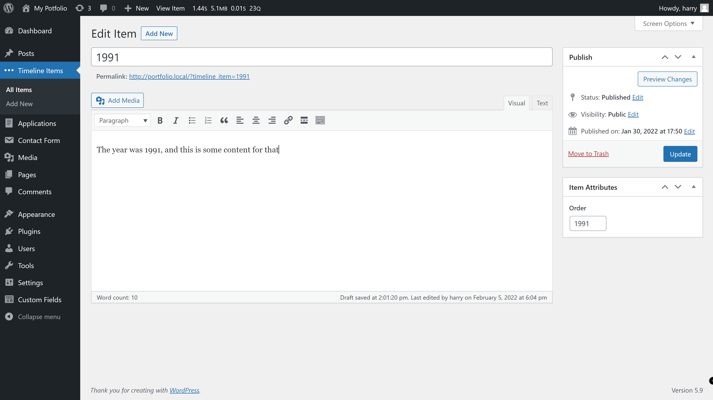
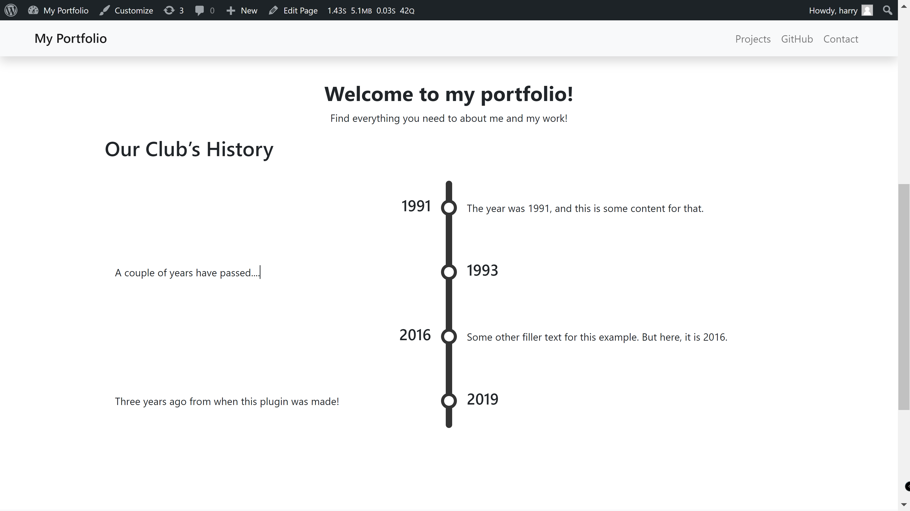

# WordPress Timeline

A shortcode to create a timeline that uses bootstrap for the design and a custom post type for the timeline items.

### Setup

- Download the plugin as a zip file
- Go to plugins in WP admin, click Add New, and upload the zip file
- Activate the plugin
- Add the timeline items through the "Timeline Items" post type in the menu
  - The order is decided through the Item Attributes > Order field

View all of items

A single item in the editing page. The order field in on the right under the Item Attributes metabox.

The timeline that is created through the shortcode.
